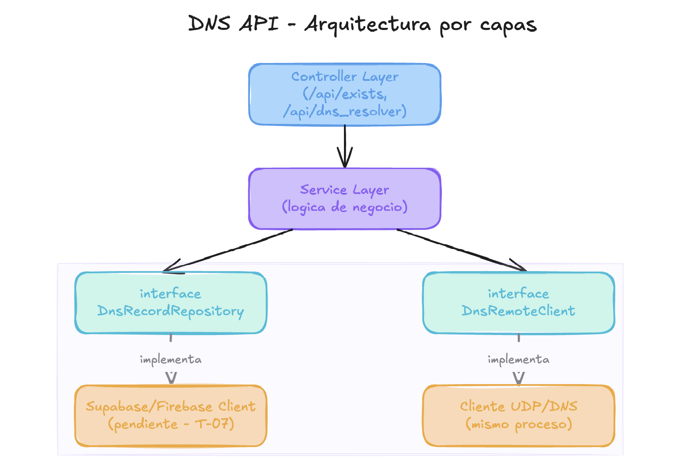

# Arquitectura del componente DNS API

## 1. Estilo arquitectónico

Se adopta una **arquitectura por capas** (Controller → Service → Interfaces de acceso a infraestructura), con **inversión de dependencias** aplicada de forma explícita: el Service Layer no depende de implementaciones concretas de persistencia ni del cliente UDP, sino de interfaces (`DnsRecordRepository`, `DnsRemoteClient`).

Se descarta un hexagonal completo (Ports & Adapters con separación total de paquetes `domain/`, `application/`, `adapter/in`, `adapter/out`) por decisión de consistencia con el resto del proyecto: los demás componentes (Interceptor en Rust, Health Checker en C, orquestación) no aplican un nivel de formalización equivalente, y sobre-desarrollar la DNS API frente al resto no aporta valor a la nota grupal ni a la evaluación presencial conjunta. El tiempo ganado se invierte en las estrategias de resolución (single/multi/weight/round-trip/geo), pruebas y documentación, que sí tienen peso directo en la rúbrica.

Aun así, se conserva el principio central de bajo acoplamiento: **el Service Layer no conoce la tecnología concreta detrás de sus dependencias**, lo cual permite cambiar de proveedor (Supabase → Firebase, o el cliente UDP) sin modificar la lógica de negocio.



## 2. Capas

### 2.1 Controller Layer

Expone los endpoints REST y valida la forma de las peticiones entrantes, sin lógica de negocio.

| Endpoint            | Método   | Responsabilidad                                                      |
| ------------------- | -------- | -------------------------------------------------------------------- |
| `/api/exists`       | GET/POST | Verificar si un dominio existe en la base de datos.                  |
| `/api/dns_resolver` | POST     | Recibir un paquete DNS codificado en BASE64, procesarlo y responder. |

### 2.2 Service Layer

Contiene la lógica de negocio:

- Decodificación/codificación BASE64 de los paquetes recibidos/enviados.
- Parsing y serialización de mensajes DNS (según RFC1035).
- Selección de estrategia de resolución según el tipo de registro (single, multi, weight, round-trip, geo).
- Orquestación entre `DnsRecordRepository` y `DnsRemoteClient`, sin conocer sus implementaciones concretas.

### 2.3 Interfaces de infraestructura (inversión de dependencias)

```java
public interface DnsRecordRepository {
    Optional<DnsRecord> findByDomain(String domain);
    boolean exists(String domain);
}

public interface DnsRemoteClient {
    byte[] forwardQuery(byte[] rawDnsMessage, String remoteDnsIp);
}
```

El Service Layer depende únicamente de estas interfaces. Las implementaciones concretas se resuelven en tareas posteriores:

- `DnsRecordRepository` → implementación hacia Supabase/Firebase (definida en T-07).
- `DnsRemoteClient` → cliente UDP corriendo en el mismo proceso Spring Boot como `@Service` (sin contenedor separado, ya que no se reutiliza fuera de la API ni requiere escalado independiente).

## 3. Flujo general de una petición `/api/dns_resolver`

1. El Controller recibe el POST con el campo `data` en BASE64 y lo decodifica a bytes.
2. El Service parsea el mensaje DNS (header + question) según RFC1035.
3. El Service consulta `DnsRecordRepository.findByDomain(...)`.
4. Si existe el registro: se aplica la estrategia de resolución correspondiente (single/multi/weight/round-trip/geo).
5. Si no existe o está unhealthy: se delega a `DnsRemoteClient.forwardQuery(...)` hacia el servidor DNS remoto.
6. El Service serializa la respuesta a formato DNS binario.
7. El Controller codifica la respuesta en BASE64 y la retorna en el cuerpo HTTP.

## 4. Consideraciones de diseño

- **Configuración externa**: IP del servidor DNS remoto y credenciales de Supabase/Firebase inyectadas por variables de entorno, sin valores quemados en código.
- **Concurrencia**: tanto el Controller (pool de hilos por defecto de Spring Boot) como el cliente UDP deben soportar múltiples solicitudes simultáneas.
- **Extensibilidad controlada**: las interfaces permiten cambiar de proveedor de base de datos sin tocar Service ni Controller, sin necesidad de la estructura completa de paquetes de un hexagonal.
