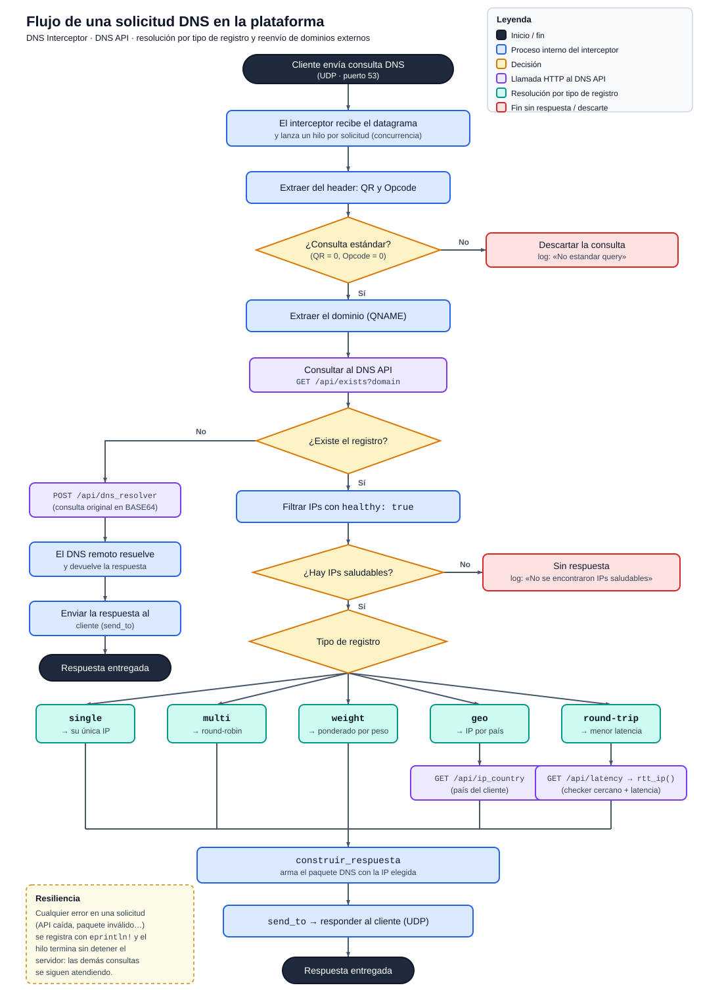

# Proyecto 1 - Redes


## Miembros del grupo

| Carné      | Nombre completo               |
| ---------- | ----------------------------- |
| 2023064329 | Luis Fernando Ureña Corrale   |
| 2023097390 | Fabricio Herrera Rodríguez    |
| 2024154899 | Djedrielle Alexander Vargas   |
| 2023223291 | Nicole Tatiana Parra Valverde |

## Módulos

- **DNS Interceptor:** Aplicación desarrollada en Rust que escucha en el puerto UDP/53. Esta aplicación recibe paquetes del protocolo DNS, los examina y siguiendo la especificación oficial del RFC2929, los procesa.
- **DNS API:** API REST desarrollada en Java 21 con Spring Boot. Es el backend central: conecta el DNS Interceptor, la DNS UI y el Health Checker con la base de datos PostgreSQL en Supabase. Resuelve dominios registrados, reenvía los externos a un DNS upstream (8.8.8.8), ubica el país de una IP y ofrece el CRUD de registros, rangos IP-país, targets y resultados de health.
- **Health Checker:** Aplicación desarrollada en C, tiene un ciclo de vida constante que revisa la base de datos Supabase y realiza solicitudes a los records, y dependiendo del código de respuesta y tiempo de respuesta marca estos records como saludables o no saludables.
- **DNS UI:** Interfaz web para crear, editar y eliminar registros DNS. También permite configurar health checks y administrar rangos IP por país.

## Ejecutar el proyecto

### Requisitos

- **Docker Desktop** abierto y con **Kubernetes activado** (Settings → Kubernetes → Enable).
- `kubectl` y `openssl` instalados.
- Las **credenciales de la base de datos Supabase** (URL, usuario y contraseña) que entregó el equipo.

1. Abrir una terminal en la carpeta del proyecto.
2. Ejecutar:

   ```bash
   make
   ```

   La primera vez pide las credenciales de Supabase. Después construye las imágenes, despliega los servicios en Kubernetes, prueba que respondan y abre la interfaz web en el navegador. Puede tardar unos minutos.

### Usar el sistema

| Qué                   | Dónde                                 |
| --------------------- | ------------------------------------- |
| Interfaz web (DNS UI) | http://localhost:30080                |
| DNS API               | http://localhost:8080/api/records     |
| DNS Interceptor       | `dig @127.0.0.1 -p 30053 ejemplo.com` |

Desde la interfaz web se crean los registros DNS, sus health checks y los rangos de IP por país.

### Comandos útiles

```bash
make k8s-status                  # ver el estado de los servicios
make k8s-test                    # verificar que todo responde
make k8s-logs S=dns-api          # ver los logs de un servicio (dns-api, dns-ui, dns-interceptor)
make k8s-down                    # detener y eliminar el despliegue
```

### Ejecutar en desarrollo (Docker Compose)

Alternativa más ligera para desarrollo y pruebas locales. Solo requiere Docker y **no debe correr al mismo tiempo que Kubernetes** (usan los mismos puertos; cada uno detiene al otro al iniciar).

```bash
make dev-up      # configura, construye y levanta los servicios
make dev-test    # verifica API, UI e interceptor
make dev-down    # detener
```

En este modo la interfaz web está en http://localhost:3000 y el interceptor en el puerto `15353` (`dig @127.0.0.1 -p 15353 ejemplo.com`).

Notas:

- Los puertos salen del Makefile y de docker-compose.yml: Kubernetes usa UI 30080, API 8080 (y 8443 por HTTPS) e Interceptor 30053. Compose usa UI 3000, API 8080 e Interceptor 15353.
- make k8s-down elimina todo el namespace dns, incluidos los Secrets. La próxima vez volverá a pedir credenciales solo si dns_api/.env no las tiene guardadas.
- Los Health Checkers se despliegan por defecto y escriben en Supabase. Con make CHECKERS=off se despliega sin ellos.

## Diagrama de Flujo


_Claude generated._

## Estado de funcionalidades

| Módulo          | Funcionalidad                           | Estado | Observaciones                                                                                                                   |
| --------------- | --------------------------------------- | :----: | ------------------------------------------------------------------------------------------------------------------------------- |
| DNS Interceptor | Tipo de registro `single`               |  100%  | Devuelve la única IP del registro.                                                                                              |
| DNS Interceptor | Tipo de registro `multi`                |  100%  | Round-robin entre las IPs del registro.                                                                                         |
| DNS Interceptor | Tipo de registro `round-trip`           |  100%  | IP de menor latencia según el checker más cercano; validado con datos simulados de un checker.                                  |
| DNS Interceptor | Tipo de registro `weight`               |  100%  | Distribución ponderada según el peso de cada IP.                                                                                |
| DNS Interceptor | Tipo de registro `geo`                  |  100%  | Resuelve por país del cliente; en Docker el NAT da origen `ZZ` y usa la IP de respaldo (con IP pública real resuelve correcto). |
| DNS API         | Consulta de dominios (`/api/exists`)    |  100%  | Devuelve el registro local o `false` si no existe.                                                                              |
| DNS API         | Resolución remota (`/api/dns_resolver`) |  100%  | Reenvía el paquete (BASE64) al DNS upstream con reintentos y guarda el dominio nuevo.                                           |
| DNS API         | IP a país (`/api/ip_country`)           |  100%  | Usa la tabla de rangos IP; sirve al tipo de registro `geo`.                                                                     |
| DNS API         | CRUD para la UI                         |  100%  | Registros, rangos IP-país, targets y resultados de salud, con validaciones y errores 400/404/409.                               |
| DNS API         | HTTPS                                   |  100%  | Opcional con `SSL_ENABLED=true` (certificado autofirmado).                                                                      |
| Health Checker  | Registro de checkeos                    |  100%  | Sube a la base de datos un registro de auditoría de todos los checkeos hechos                                                   |
| Health Checker  | Ciclo de checkeos                       |  100%  | Cicla constantemente el programa para revisar el estado de salud de cada target                                                 |
| DNS UI          | Registros DNS                           |  100%  | Permite crear, editar y eliminar los cinco tipos de registro.                                                                   |
| DNS UI          | Health checks                           |  100%  | Permite configurar pruebas TCP y HTTP para las IP de un registro.                                                               |
| DNS UI          | Rangos IP por país                      |  100%  | Permite crear, editar y eliminar rangos de IP.                                                                                  |

## Pruebas realizadas

### DNS Interceptor

Las pruebas se hicieron de forma incremental durante el desarrollo, desde la
recepción de paquetes crudos hasta el uso del interceptor como DNS del sistema.

**Requisitos previos para replicar:**

- El **DNS Interceptor** corriendo en un contenedor, con el puerto UDP 53 del
  contenedor mapeado a un puerto del host (en desarrollo se usó `15353` porque el
  `53` y el `5353` estaban ocupados por `systemd-resolved` y `avahi`).
- El **DNS API** (o el `dns_api_mock`) accesible, con `DNS_API_URL` apuntándole
  (p. ej. `http://host.docker.internal:8080`).
- Las **semillas** cargadas: un registro de cada tipo (`single`, `multi`, `weight`,
  `geo`) y el registro round-trip de `dns_interceptor/round_trip_seeds.sql`.

> En los comandos se asume el puerto de host `15353` (`dig` lo fija con `-p`; el
> sistema operativo siempre usa el 53, ver la prueba 8).

El script [`dns_interceptor/pruebas_interceptor.sh`](../dns_interceptor/pruebas_interceptor.sh)
automatiza las pruebas 3, 5 y 6 (una consulta por tipo de registro, dominio externo
y concurrencia):

```bash
./dns_interceptor/pruebas_interceptor.sh 127.0.0.1 15353
```

---

#### 1. Recepción e inspección del paquete DNS crudo

**Qué prueba:** el interceptor recibe el datagrama UDP y sus bytes siguen la
estructura DNS (header de 12 bytes, `ID`, flags, `QNAME` en labels).

Con el buffer imprimiéndose en hex (`println!("{:02x?}", &buffer[..amt])`):

```bash
dig @127.0.0.1 -p 15353 example.com
sudo tcpdump -i any -n udp port 15353 -X   # opcional: ver los bytes en el cable
```

**Esperado:** se imprimen los bytes; se reconocen `ID` (0–1), flags (2–3) y
`07 example 03 com 00` en el `QNAME`.

---

#### 2. Extracción del header y bifurcación estándar / no estándar

**Qué prueba:** el interceptor extrae `QR` y `Opcode` y solo procesa consultas
estándar (`QR=0`, `Opcode=0`).

```bash
dig @127.0.0.1 -p 15353 example.com                 # estándar -> se procesa
dig @127.0.0.1 -p 15353 +opcode=STATUS example.com  # no estándar -> se descarta
```

**Esperado:** la segunda genera `No estandar query` en el log y no se resuelve.

---

#### 3. Resolución por tipo de registro

Una estrategia por cada tipo administrado:

- **`single`** — devuelve su única IP.
- **`multi`** — round-robin: la IP rota entre consultas.
- **`weight`** — distribución ponderada (la IP de mayor peso sale más veces).
- **`geo`** — IP según el país del cliente. Por el NAT de Docker el origen es el
  gateway (`172.17.0.1` → país `ZZ`), así que cae en la IP de respaldo; para probar
  un país real: `curl "http://localhost:8080/api/ip_country?ip=200.1.2.3"`.
- **`round-trip`** — IP de menor latencia según el checker más cercano; con las
  semillas (30/90/180 ms desde CR-01) devuelve `1.1.1.1`.

```bash
dig @127.0.0.1 -p 15353 +short single.example.com
for i in $(seq 1 6);   do dig @127.0.0.1 -p 15353 +short multi.example.com;  done
for i in $(seq 1 100); do dig @127.0.0.1 -p 15353 +short weight.example.com; done | sort | uniq -c
dig @127.0.0.1 -p 15353 +short geo.example.com
dig @127.0.0.1 -p 15353 +short rtt.example.com
```

---

#### 4. Filtrado de IPs no saludables

**Qué prueba:** solo se devuelven IPs con `healthy: true`. Marcar una IP como
`false` en la BD y consultar varias veces: nunca se retorna. Si todas están no
saludables, se registra `No se encontraron IPs saludables...` y no responde.

---

#### 5. Resolución de dominios externos (no administrados)

**Qué prueba:** un dominio ausente en la BD se reenvía al DNS remoto vía
`POST /api/dns_resolver` (BASE64) y su respuesta se devuelve al cliente.

```bash
dig @127.0.0.1 -p 15353 google.com
```

**Esperado:** sección `ANSWER` con la(s) IP(s) reales del dominio.

---

#### 6. Concurrencia

**Qué prueba:** el interceptor atiende varias consultas a la vez (un hilo por
solicitud), sin serializarlas.

```bash
for i in $(seq 1 10); do dig @127.0.0.1 -p 15353 +short geo.example.com & done; wait
```

**Esperado:** las 10 responden sin bloquearse entre sí; en el log se ven trazas
intercaladas.

---

#### 7. Robustez ante fallos por solicitud

**Qué prueba:** un error en una consulta (API caída, respuesta inválida, paquete mal
formado) no tumba el servidor. Detener el DNS API, consultar un dominio administrado
y volver a levantarlo: se registra `Error consultando /api/exists...` pero el
interceptor sigue vivo y responde cuando el API regresa.

---

#### 8. Uso del interceptor como DNS del sistema (prueba end-to-end)

**Descripción:** verifica el flujo completo usando el interceptor como resolvedor DNS
de toda la máquina y navegando por internet.

**Cómo replicar:**

1. Exponer el interceptor en el puerto 53 del loopback:
   ```bash
   sudo docker run --rm -it -p 127.0.0.1:53:53/udp \
     --add-host=host.docker.internal:host-gateway \
     -e DNS_API_URL=http://host.docker.internal:8080 \
     -v "$(pwd)/dns_interceptor:/app" -v cargo-target:/app/target -w /app \
     rust:latest cargo run
   ```
2. Apuntar `systemd-resolved` a `127.0.0.1` en `/etc/systemd/resolved.conf`
   (`DNS=127.0.0.1`, `Domains=~.`) y reiniciar: `sudo systemctl restart systemd-resolved`.
3. Navegar (`curl -I https://example.com` o abrir un navegador).

**Resultado esperado:** las páginas cargan; en el log del interceptor se ve el alto
volumen de consultas del sistema. Para revertir, quitar las líneas de `resolved.conf`
y reiniciar `systemd-resolved`.

> Limitación conocida: el interceptor solo maneja UDP; respuestas que requieran TCP
> (truncación / bit `TC`) o dominios muy grandes pueden fallar.

### DNS API

**Requisitos previos:** el DNS API corriendo en `http://localhost:8080` con credenciales de Supabase válidas. Los comandos usan `curl`. Además hay pruebas unitarias y una colección de Postman.

#### 1. Pruebas unitarias

```bash
cd dns_api
mvn test
```

**Esperado:** `BUILD SUCCESS`. Son 130 pruebas y cubren el 93 % de las líneas.

#### 2. CRUD de registros DNS

**Qué prueba:** crear, listar, actualizar y eliminar un registro.

```bash
curl -i -X POST http://localhost:8080/api/records -H 'Content-Type: application/json' \
  -d '{"name":"prueba.example.com","type":"single","ttl":60,"ips":[{"ip":"1.2.3.4","healthy":true}]}'
curl -s http://localhost:8080/api/records
curl -i -X PUT http://localhost:8080/api/records/prueba.example.com -H 'Content-Type: application/json' \
  -d '{"name":"prueba.example.com","type":"single","ttl":120,"ips":[{"ip":"5.6.7.8","healthy":true}]}'
curl -i -X DELETE http://localhost:8080/api/records/prueba.example.com
```

**Esperado:** `201`, la lista con el registro, `200` con la IP nueva y `204` al eliminar.

#### 3. Consulta de dominio local (`/api/exists`)

```bash
# Crear de nuevo prueba.example.com (paso 2, POST) antes de esta consulta
curl -s "http://localhost:8080/api/exists?domain=pste
curl -s "http://localhost:8080/api/exists?domain=no-existe.example.com" # no existe
```

**Esperado:** el objeto del registro en la primerasegunda.

#### 4. Resolución remota (`/api/dns_resolver`)

**Qué prueba:** un paquete DNS en BASE64 se reenvía al DNS upstream y vuelve la respuesta.

```bash
PKT=$(printf '\x12\x34\x01\x00\x00\x01\x00\x00\x00com\x00\x00\x01\x00\x01' | base64)
curl -s -X POST http://localhost:8080/api/dns_resolver -H 'Content-Type: application/json' -d "{\"data\":\"$PKT\"}"
```

**Esperado:** `200` con `{"data":"<respuesta en BAválido (por ejemplo `"abc"`) responde `400`.

#### 5. IP a país (`/api/ip_country`)

```bash
curl -s "http://localhost:8080/api/ip_country?ip=2
curl -i "http://localhost:8080/api/ip_country?ip=no-es-ip"
```

**Esperado:** `{"country_code":"..."}` (o `false` si no hay rango) y `400` para la IP inválida.

#### 6. Validaciones y errores

```bash
curl -i -X POST http://localhost:8080/api/records -H 'Content-Type: application/json' \
  -d '{"name":"malo.example.com","type":"otro","tt4"}]}'   # 400: tipo inválido
curl -i -X DELETE http://localhost:8080/api/records/no-existe.example.com            # 404
```

**Esperado:** los errores llegan con el formato `{ dos veces el mismo registro devuelve `409`.

> Colección completa: `dns_api/docs/DNS_API.postmaiciones, todos los endpoints).

### DNS UI

Las pruebas se hicieron con el DNS API disponible en `http://localhost:8080`.

Los prompts utilizados y los problemas encontrados se documentan en [Uso de IA](uso-ia.md).

#### 1. Iniciar la interfaz

Desde la carpeta principal del proyecto:

```bash
cd dns-ui
docker compose up --build
```

Abrir `http://localhost:3000`. La página debe cargar y mostrar los registros DNS.

#### 2. Probar los registros DNS

1. Crear un registro de cada tipo: `single`, `multi`, `weight`, `round-trip` y `geo`.
2. Editar uno de los registros.
3. Eliminar uno de los registros.

**Resultado esperado:** los cambios se muestran en la tabla y quedan guardados en el DNS API.

#### 3. Probar los health checks

1. Crear un registro con una prueba TCP.
2. Editar el registro y cambiar la prueba a HTTP.
3. Guardar los cambios.

**Resultado esperado:** la interfaz guarda los datos de cada prueba sin errores.

#### 4. Probar los rangos IP por país

1. Crear un rango de IP y asignarle un país.
2. Editar el rango.
3. Eliminar el rango.

### Health Checker

Las pruebas se ejecutan al correr el programa utilizando Docker, el programa corre en su propio contenedor e irá actualizando en consola todo lo que está pasando

**Como se ve un ciclo de ejecución**

```bash
[2026-09-29 09:00:00] Health Checker iniciado (Proyecto1_IC7602)...
[2026-09-29 09:00:00] [HEALTH_CHECKER] location=CR-01 country=CR city=Cartago lat=9.8644 lon=-83.9194
[2026-09-29 09:00:00] [HEALTH_CHECKER] Conectado a la base de datos


[2026-09-29 09:00:01] [HEALTH_CHECKER] [TCP] intento 1/3 target=1.1.1.1:443 -> UP (14.02ms)
[2026-09-29 09:00:01] [HEALTH_CHECKER] [TCP] intento 2/3 target=1.1.1.1:443 -> UP (13.61ms)
[2026-09-29 09:00:01] [HEALTH_CHECKER] [TCP] intento 3/3 target=1.1.1.1:443 -> UP (14.30ms)
[2026-09-29 09:00:01] [HEALTH_CHECKER] Resultado final target=1.1.1.1:443 successes=3/3 -> HEALTHY (avg 13.98ms)
[2026-09-29 09:00:01] [HEALTH_CHECKER] record=dns-cloudflare-single ip=1.1.1.1 actualizado a healthy=true

[2026-09-29 09:00:02] [HEALTH_CHECKER] [TCP] intento 1/3 target=8.8.8.8:53 -> UP (12.40ms)
[2026-09-29 09:00:02] [HEALTH_CHECKER] [TCP] intento 2/3 target=8.8.8.8:53 -> UP (11.87ms)
[2026-09-29 09:00:02] [HEALTH_CHECKER] [TCP] intento 3/3 target=8.8.8.8:53 -> UP (13.02ms)
[2026-09-29 09:00:02] [HEALTH_CHECKER] Resultado final target=8.8.8.8:53 successes=3/3 -> HEALTHY (avg 12.43ms)
[2026-09-29 09:00:02] [HEALTH_CHECKER] record=dns-google-multi ip=8.8.8.8 actualizado a healthy=true

[2026-09-29 09:00:02] [HEALTH_CHECKER] [TCP] intento 1/3 target=8.8.4.4:53 -> UP (12.11ms)
[2026-09-29 09:00:02] [HEALTH_CHECKER] [TCP] intento 2/3 target=8.8.4.4:53 -> UP (12.55ms)
[2026-09-29 09:00:03] [HEALTH_CHECKER] [TCP] intento 3/3 target=8.8.4.4:53 -> UP (11.90ms)
[2026-09-29 09:00:03] [HEALTH_CHECKER] Resultado final target=8.8.4.4:53 successes=3/3 -> HEALTHY (avg 12.19ms)
[2026-09-29 09:00:03] [HEALTH_CHECKER] record=dns-google-multi ip=8.8.4.4 actualizado a healthy=true

[2026-09-29 09:00:03] [HEALTH_CHECKER] [HTTP] intento 1/3 target=neverssl.com:80 -> UP (178.44ms)
[2026-09-29 09:00:03] [HEALTH_CHECKER] [HTTP] intento 2/3 target=neverssl.com:80 -> UP (181.09ms)
[2026-09-29 09:00:04] [HEALTH_CHECKER] [HTTP] intento 3/3 target=neverssl.com:80 -> UP (176.87ms)
[2026-09-29 09:00:04] [HEALTH_CHECKER] Resultado final target=neverssl.com:80 successes=3/3 -> HEALTHY (avg 178.80ms)
[2026-09-29 09:00:04] [HEALTH_CHECKER] record=http-plain-single ip=neverssl.com actualizado a healthy=true

[2026-09-29 09:00:04] [HEALTH_CHECKER] [HTTP] intento 1/3 target=54.161.165.160:80 -> DOWN (320.18ms)
[2026-09-29 09:00:04] [HEALTH_CHECKER] [HTTP] intento 2/3 target=54.161.165.160:80 -> DOWN (321.51ms)
[2026-09-29 09:00:05] [HEALTH_CHECKER] [HTTP] intento 3/3 target=54.161.165.160:80 -> DOWN (313.79ms)
[2026-09-29 09:00:05] [HEALTH_CHECKER] Resultado final target=54.161.165.160:80 successes=0/3 -> UNHEALTHY (avg 318.49ms)
[2026-09-29 09:00:05] [HEALTH_CHECKER] record=crhoy.com ip=54.161.165.160 actualizado a healthy=false
```

En este ciclo de vida se observa como se realizan tanto conexiones TCP como HTTP, muestre el target al que se hace y el tiempo que tarda en responder el record, actualiza el estado de cada uno y si recibe el código esperado y el tiempo de respuesta en el umbral esperado se marca como unhealthy.

Note como el ultimo registro de crhoy se marca como unhealthy, esto es porque no se recibe el código esperado de respuesta, ya que la ip no coincide con una ip válida para el record

## Video de demostración

«»

## Conclusiones y recomendaciones

### Conclusiones

1. Es posible lograr que el interceptor opere end-to-end como DNS del sistema. En algunas páginas la latencia del de la plataforma puede hacer que no se logre acceder con la comodidad de un resolver normal, pero sí es posible conseguir conexión a internet con esta implementación.
2. El modelo de concurrencia en Rust (`UdpSocket` compartido con `Arc` y un hilo por
   solicitud) dio un servidor concurrente y resiliente: un fallo en una consulta se
   registra sin detener el proceso.
3. La selección `round-trip` (checker más cercano por haversine + menor latencia) se
   validó con mediciones simuladas, confirmando el uso de los health checkers como
   proxy de la ubicación del cliente.
4. Armar un DNS propio ayuda a entender lo que pasa cada vez que se abre una página web. Como detrás hay un paquete con un formato exacto, una consulta al servidor correcto y una respuesta que debe llegar a tiempo. Ver que cada tipo de registro (`single`, `multi`, `weight`, `geo`, `round-trip`) es una forma distinta de decidir a qué servidor mandar al usuario muestra que el DNS sirve, además de traducir nombres, para repartir carga y elegir el mejor servidor.
5. Un DNS tiene que ser rápido y no puede fallar aunque algo a su alrededor falle. Cada consulta espera una respuesta al instante, así que se notó cuánto pesa la latencia de la plataforma y por qué hay que decidir qué hacer si el API o un servidor no responden.
6. La mayoría simple sobre varios intentos (retries) por ciclo es suficiente para absorber fallas transitorias de red y evitar que un solo timeout puntual marque un servicio sano como caído.
7. Casi todos los problemas encontrados durante las pruebas no fueron de lógica del programa, sino de infraestructura externa: resolución IPv6, límites de pooling de conexiones, y comportamiento de balanceadores/CDNs frente a chequeos por IP directa.
8. Agregar timestamp a cada línea de log fue clave para poder correlacionar eventos en el tiempo — por ejemplo, para confirmar que una caída de conexión a la base de datos ocurrió a mitad de un ciclo y no al inicio.
9. La interfaz web facilita el manejo de los registros DNS, ya que permite crear, editar y eliminar la información sin trabajar directamente con la base de datos.
10. La conexión entre la DNS UI y el DNS API permitió mantener separada la parte visual de la lógica del sistema, haciendo que el proyecto sea más fácil de entender y probar.

### Recomendaciones

1. Si queda tiempo durante la implementación sería bueno implementar soporte TCP para respuestas que excedan los 512 bytes de UDP; es la limitación principal actual.
2. Agregar validación de límites (bounds checks) al indexado de bytes en
   `extraer_host`/`construir_respuesta` para blindar el parseo ante paquetes mal formados.
3. Tratar de disminuir la latencia de la plataforma a la hora de resolver dominios externos es clave para lograr una utilización cómo en caso de querer utilizar el intercpetor como DNS del sistema.
4. Conocer el límite de conexiones que se permite desde la plataforma de supabase, así se evita usar conexiones de tipo transaction.
5. Guardar las respuestas más frecuentes en memoria por el tiempo que indica el TTL, como hacen los DNS reales. Así no se consultaría la base de datos en cada solicitud y el sistema respondería más rápido y aguantaría más consultas.
6. Poner más de una copia del Interceptor y más Health Checkers en distintas ubicaciones. Hoy, si el Interceptor cae, ya no hay DNS. Con más réplicas el servicio seguiría en pie y la elección `round-trip` y `geo` sería más precisa.
7. Probar el sistema con más carga y más casos: muchos usuarios a la vez, registros cuyas IPs quedan todas no saludables, y servidores DNS externos que fallan. Son situaciones comunes en un DNS real, y conocer cómo responde el sistema nos diría dónde reforzarlo primero.
8. Registrar en el log el código de respuesta HTTP real obtenido (no solo "UP"/"DOWN"), para poder diagnosticar sin adivinar por qué un chequeo falló.
9. Coordinar con el resto del equipo el uso de conexiones durante las pruebas (apagar contenedores de prueba que ya no se estén usando), para no agotar el pool compartido de Supabase entre todos los integrantes.
10. Evaluar agregar reintentos con backoff progresivo para la reconexión a la base de datos, en vez de esperar el intervalo completo del ciclo tras una caída, para reducir el tiempo sin monitoreo activo.
